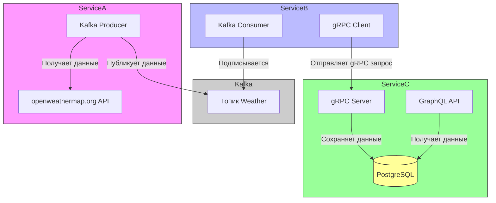

# KazanWeather

Основная задача:  Получить 10 последних записей о погоде в Казани.

Есть три сервиса: ServiceA, ServiceB, ServiceC. В проекте используется Apache Kafka, gRPC, GraphQL




ServiceA: Является Kafka producer. Раз в минуту получает данные о погоде в Казани в текущий момент с [стороннего API](https://openweathermap.org/), обрабатывает эти данные и отправляет в Apache Kafka в топик Weather.

ServiceB: Является Kafka consumer и gRPC клиентом. Подписывается на топик Weather и получает оттуда данные о погоде, также обрабатывает их и отправляет gRPC запрос в ServiceC, используя порт 5002.

SerciceC: Является gRPC сервером. Получает по Grpc данные о погоде. После получения данные отправляются в базу данных. Используя GraphQL, на 5001 порте, мы можем получить 10 последних записей о погоде в Казани.
Вот query, по которому получаем результат:
```
query {
  latestTenRecords(take: 10, order: { createDate: DESC }) {
    items {
      createDate
      description
      id
      temperature
      temperatureFeelsLike
      weatherDate
      windSpeed
    }
  }
}
```

Запуск Kafka:
1) Получение Docker образа:
```
docker pull apache/kafka:4.0.0
```
3) Запуск контейнера Kafka в Docker:
```
docker run -p 9092:9092 apache/kafka:4.0.0
```
